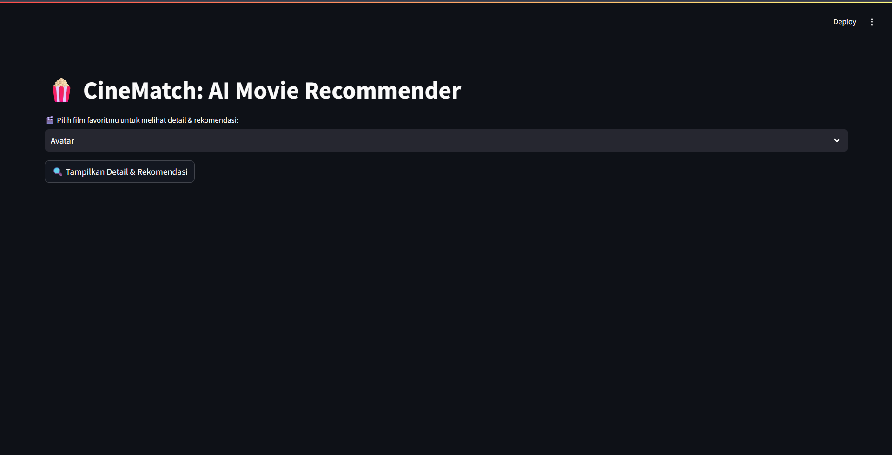
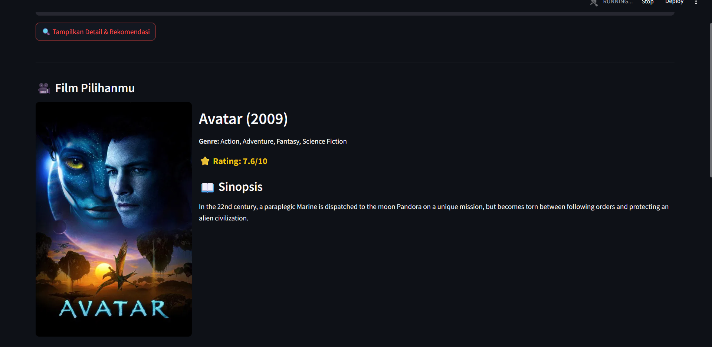

# 🎬 CineMatch: AI Movie Recommender System

**CineMatch** adalah aplikasi sistem rekomendasi film cerdas berbasis konten (_Content-Based Filtering_). Aplikasi ini menggunakan Machine Learning untuk menganalisis kemiripan sinopsis, genre, dan kata kunci antar film, lalu merekomendasikan film yang paling relevan dengan selera pengguna.

Dibangun dengan **Python**, **Streamlit**, dan terintegrasi dengan **TMDB API** untuk menampilkan data visual yang kaya.

---

## 🖼️ Tampilan Aplikasi

### 1. Dashboard Utama

Tampilan awal yang bersih dan responsif. Pengguna disambut dengan antarmuka pencarian film yang intuitif.


### 2. Detail Film Pilihan (Hero Section)

Setelah pengguna memilih judul, aplikasi menampilkan **Sorotan Utama** film tersebut secara eksklusif. Menampilkan poster resolusi tinggi, rating, genre, dan sinopsis lengkap yang ditarik secara _real-time_ dari API TMDB.


### 3. Hasil Rekomendasi Cerdas

Di bawah sorotan utama, AI menampilkan 5 film yang paling mirip secara konten (cerita/plot). Setiap rekomendasi dilengkapi dengan tombol _expander_ untuk melihat sinopsis singkat tanpa perlu berpindah halaman.


---

## ✨ Fitur Unggulan

- **🔍 AI-Powered Search**: Menggunakan algoritma **Cosine Similarity** dan **TF-IDF/Count Vectorizer** untuk menemukan kemiripan cerita antar film dengan akurasi tinggi.
- **📡 Real-time Data Fetching**: Terintegrasi dengan **The Movie Database (TMDB) API** untuk mengambil poster film, rating terbaru, dan sinopsis lengkap.
- **📱 Interactive UI**: Layout modern dengan "Hero Section" untuk film terpilih dan Grid Layout untuk rekomendasi.
- **⚡ Optimized Performance**: Menggunakan sistem _caching_ (`@st.cache_data`) agar loading model AI yang berat hanya terjadi sekali saat aplikasi dibuka.

---

## 🛠️ Teknologi yang Digunakan (Tech Stack)

- **Bahasa Pemrograman**: Python 3.11.7
- **Frontend Framework**: [Streamlit](https://streamlit.io/)
- **Machine Learning**: Scikit-Learn (CountVectorizer, Cosine Similarity)
- **Data Processing**: Pandas, NumPy
- **API Integration**: Requests (TMDB API)
- **Data Serialization**: Joblib

---

## 📂 Struktur Folder Project

```text
movie-recommender-project/
│
├── data/                  # Dataset mentah (CSV dari Kaggle)
├── models/                # Model AI yang sudah dilatih (.pkl)
│   ├── movie_list.pkl     # Daftar judul film
│   └── similarity.pkl     # Matrix kemiripan (Otak AI)
├── notebooks/             # Jupyter Notebook untuk training model
├── app.py                 # Main Application (Streamlit)
├── requirements.txt       # Daftar library python
└── README.md              # Dokumentasi Project
```
